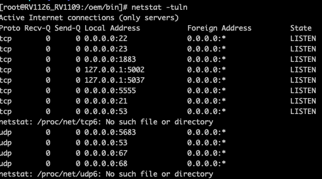
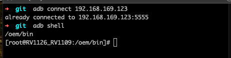

# Insecure Lawn Mower Ahead (as of firmware version 3.0.13)!

Recordings available now and in the future [on Youtube](https://github.com/jrm16020/roboup-mower) to help with demonstrating the issues.

If you want to know more about the lawn mower, just log in and check it out!

More to come as I get more free time.  The mower is running on the RV1126_RV1109 demo board from Rockchip and has lots of services running that have no clear use case.

## CVEs

- Request 1520564 filed for the unauthenticated remote code execution via ADB exposed to the LAN
- Request 1515484 filed and waiting for review.
